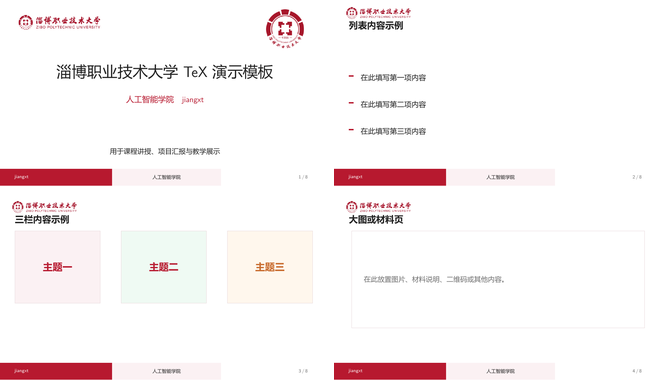
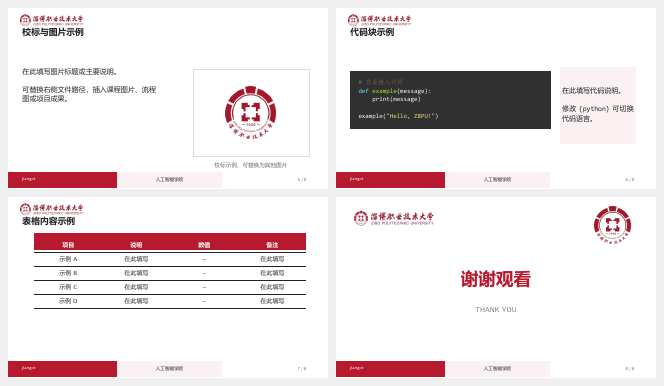

# ZBPU Beamer Template


淄博职业技术大学自用 TeX 演示模板（非官方），适用于课程讲授与项目汇报。

## 基本环境

- TeX Live 2021+ 或 MiKTeX
- VS Code + LaTeX Workshop
- Python 3 + Pygments，用于 `minted` 代码高亮
- XeLaTeX，并启用 `-shell-escape -8bit`

## VS Code 编译

打开 `template.tex`，选择仓库自带的 `xe->xe` 配方。该配方依次执行：

1. 第一次 XeLaTeX 编译，生成页面、导航和定位信息。
2. 第二次 XeLaTeX 编译，读取辅助信息，使页码、TikZ 覆盖元素和图片位置稳定。
3. 删除 `.nav`、`.snm`、`.vrb` 和 `.synctex.gz` 文件。

项目启用了 `latex-workshop.latex.autoClean.run: onBuilt`。编译成功后，LaTeX Workshop 还会按照 `.vscode/settings.json` 中的 `latex-workshop.latex.clean.fileTypes` 清理 `.aux`、`.log`、`.out`、`.toc`、`.fls`、`.fdb_latexmk` 和其他辅助文件。

自动清理不会删除 `template.tex`、PDF、图片和其他素材。

## minted 缓存

模板保留 `minted` 语法高亮，并把缓存写入固定子目录：

```tex
\usepackage[cachedir=minted-cache]{minted}
```

该设置兼容 TeX Live 2026 对写入位置的限制。请保留 `minted-cache` 文件夹。自动清理可能移除其中的 `.minted` 中间文件，下一次使用 `-shell-escape` 编译时会自动重新生成。

## 命令行编译

不使用 VS Code 时，可在模板目录运行：

```powershell
.\compile.cmd
```

脚本会创建 `minted-cache`，设置允许写入的输出路径，并连续执行两次 XeLaTeX。命令行脚本不会调用 LaTeX Workshop 的自动清理规则。

也可以使用：

```powershell
latexmk template.tex
```

`latexmkrc` 已设置 XeLaTeX、`-shell-escape` 和 `minted-cache` 所需的输出路径。

## 代码页

代码页采用 `minted`，默认使用 Monokai 风格、深色背景、自动换行和 Python 语法高亮。参考：[Overleaf Code Presentations Example](https://www.overleaf.com/latex/examples/code-presentations-example-different-ways-shown-in-beamer-metropolis/tsxpnyjbhbds)。

## 文件结构

```text
.
├─ template.tex             # 模板源文件
├─ template.pdf             # 编译预览
├─ compile.cmd              # 命令行编译入口
├─ latexmkrc                # latexmk 与 minted 输出设置
├─ minted-cache/            # minted 高亮缓存目录
├─ assets/                  # 校标、页眉和预览素材
│  ├─ cover_logo.png
│  ├─ cover_mark.png
│  ├─ header_logo.png
│  ├─ preview-pages-1-4.png
│  └─ preview-pages-5-8.png
└─ .vscode/settings.json    # 两次编译与自动清理配置
```

## 模板预览

第 1–4 页：



第 5–8 页：

